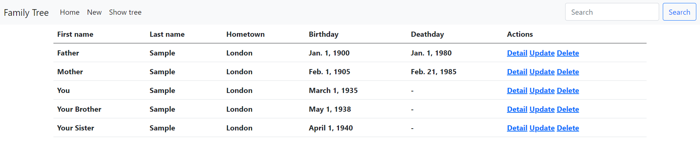
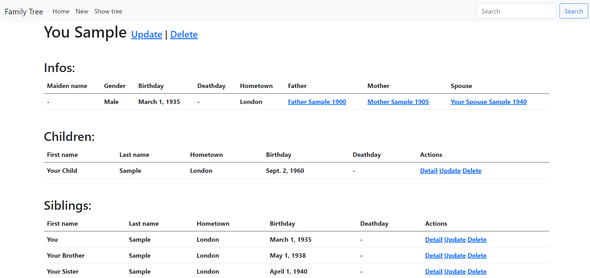
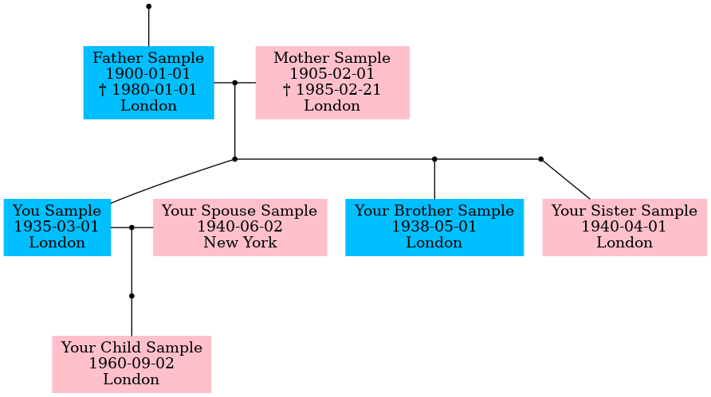

# Family tree

### App to visualize your family structures

This app is inspired by the [familytreemaker](https://github.com/adrienverge/familytreemaker) app of Adrien Vergé. I did rewrite all of the code to render the tree.


## Features

- Dockerized App ready to start
- Add persons and their relationship
- Search function
- Overview of all added persons



- Detail page for every person with links to relatives



- Render your family tree



- Download PDF or PNG of your family tree

## Install

- Fork or download the repo
- Create a django.env file inside the django_data folder

```shell
#Example variables for development
SECRET_KEY=thisismysecretkey
ALLOWED_HOSTS=*
POSTGRES_USER=postgres
POSTGRES_PASSWORD=password
DEBUG=True
```

- Create a postgres.env file inside the postgres_data folder

```shell
#Example variables for development
POSTGRES_PASSWORD=password
POSTGRES_USER=postgres
```

- Start the docker container

```shell
docker-compose up
```

- Make migrations

```shell
docker-compose exec web python manage.py makemigrations
docker-compose exec web python manage.py migrate
```

- Collect static files

```shell
docker-compose exec web python manage.py collectstatic
```

- Restart the docker container

```shell
docker-compose down
docker-compose up
```

- If you want to add the sample family run

```shell
docker-compose exec web python manage.py import --filename example_family.json
```